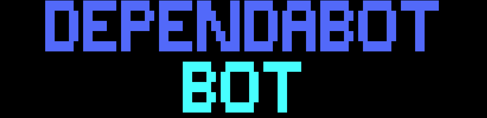
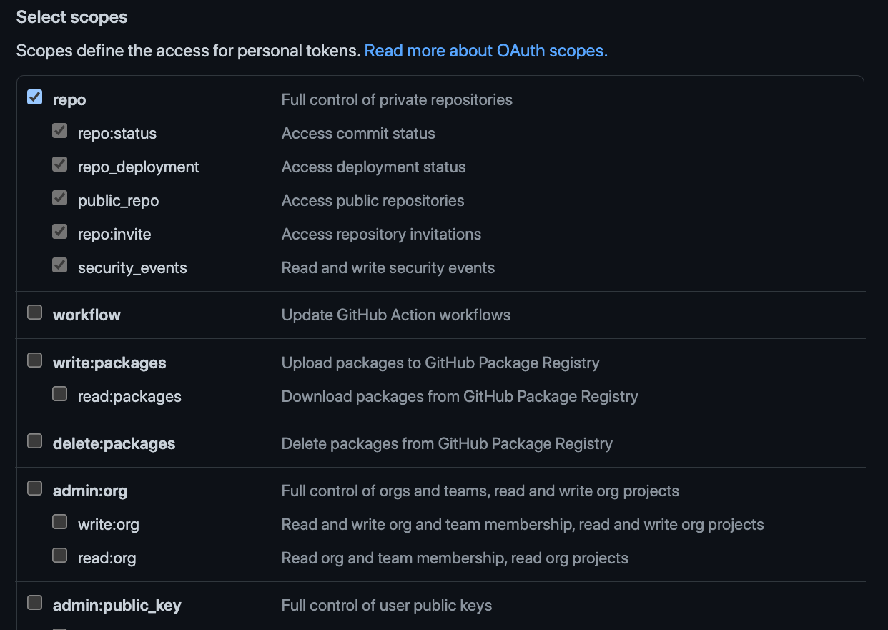

# Dependabotbot

Have you been the victim of a lodash update? Has your notification page in Github been assaulted by needing to update a patch version of hosted-git-info?

Fret no more. Dependabotbot is a tool to group your dependabot merge requests by dependency and merge them in one fell swoop.

Currently only patch versions are handled however we plan to make it configurable.

## Installation

Run this from your CLI to install dependabotbot:

```
curl -o- -s https://raw.githubusercontent.com/cmgriffing/dependabotbot/main/install.sh | bash
```

You can also pass in a directory already on your PATH.

```
curl -o- -s https://raw.githubusercontent.com/cmgriffing/dependabotbot/main/install.sh | bash -s -- -b /usr/local/bin/
```

## Github Credentials

You will need to get a PAT (Personal Access Token). The permissions only need to be able to access your repos.

You only need to give it repo access.



Once you have that token, you can use the cli arguments:

```sh
dependabotbot --username GITHUB_USERNAME --token GITHUB_TOKEN
```

or you can use a JSON config file in your home folder (`~/.dependabotbot`).

```json
{
  "username": "GITHUB_USERNAME",
  "token": "GITHUB_TOKEN"
}
```

You can also pass a path to your config if you wish to keep it elsewhere:

```sh
dependabotbot --config ~/.YOUR_CONFIG
```


## Usage

Just one command for now.

```
dependabotbot
```

Currently, we use an interactive interface. Eventually a headless mode will be made.

## License

Copyright 2021 Chris Griffing

Permission is hereby granted, free of charge, to any person obtaining a copy of this software and associated documentation files (the "Software"), to deal in the Software without restriction, including without limitation the rights to use, copy, modify, merge, publish, distribute, sublicense, and/or sell copies of the Software, and to permit persons to whom the Software is furnished to do so, subject to the following conditions:

The above copyright notice and this permission notice shall be included in all copies or substantial portions of the Software.

THE SOFTWARE IS PROVIDED "AS IS", WITHOUT WARRANTY OF ANY KIND, EXPRESS OR IMPLIED, INCLUDING BUT NOT LIMITED TO THE WARRANTIES OF MERCHANTABILITY, FITNESS FOR A PARTICULAR PURPOSE AND NONINFRINGEMENT. IN NO EVENT SHALL THE AUTHORS OR COPYRIGHT HOLDERS BE LIABLE FOR ANY CLAIM, DAMAGES OR OTHER LIABILITY, WHETHER IN AN ACTION OF CONTRACT, TORT OR OTHERWISE, ARISING FROM, OUT OF OR IN CONNECTION WITH THE SOFTWARE OR THE USE OR OTHER DEALINGS IN THE SOFTWARE.
